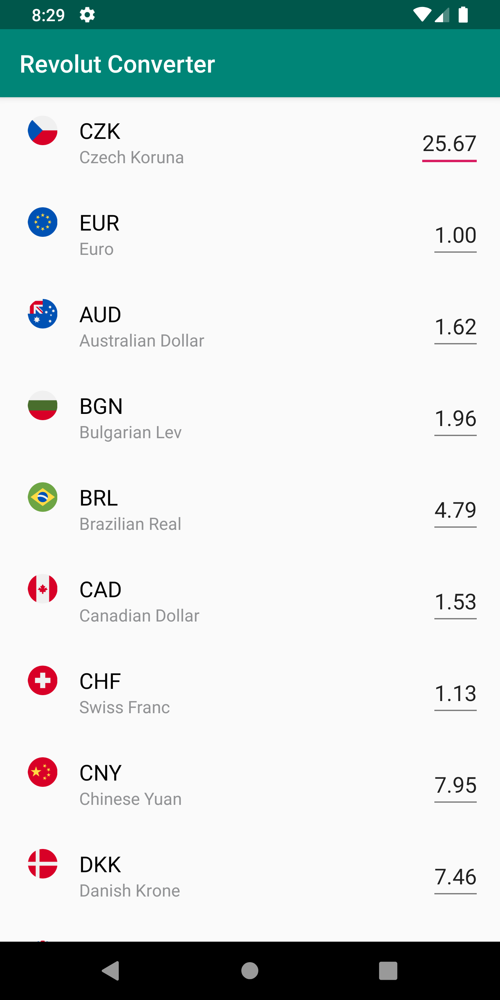
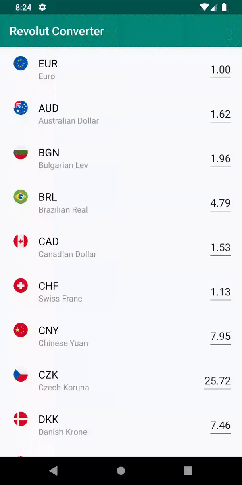

A fully-reactive currency converter utilizing Model-View-Intent pattern.

# Screenshots

<p>
  
  
</p>


# Architecture

This project utilizes MVI pattern according to the official sample by [oldergod](https://github.com/oldergod/android-architecture)

# Unit tests

To run unit test use this command:

```
./gradlew test
```

# Linting

To perform linting of the code the following command can be used:

```
./gradlew ktlint
```

Also, there is another command to automatically fix the code:

```
./gradlew ktlintFormat
```

# Libraries

* RxJava 2
* Retrofit
* Koin
